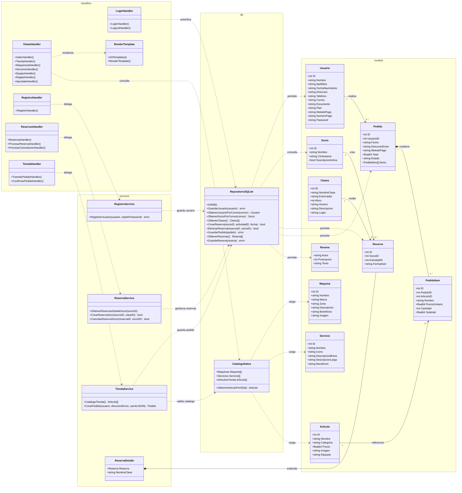

# Diagrama UML Del Proyecto

Este diagrama representa la arquitectura de clases y paquetes principales de Platinium Gym. El proyecto está organizado en capas: controladores HTTP (`handlers`), lógica de negocio (`services`), acceso a datos (`db`) y entidades (`models`).

## Lectura Del Diagrama

- `handlers` recibe las peticiones HTTP y decide qué vista renderizar o qué acción ejecutar.
- `services` concentra la lógica de negocio: validación de registro, cálculo de reservas y creación de pedidos.
- `db` encapsula SQLite y los catálogos iniciales de maquinaria, servicios y tienda.
- `models` contiene las entidades usadas por las plantillas, servicios y base de datos.
